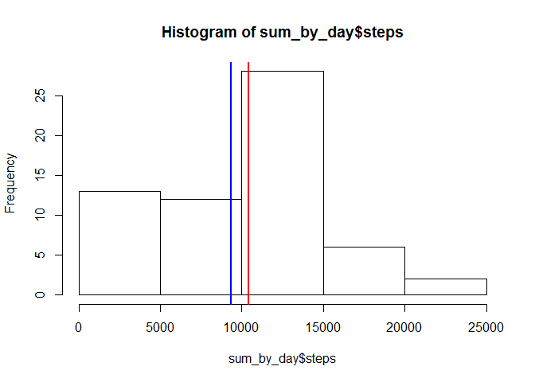
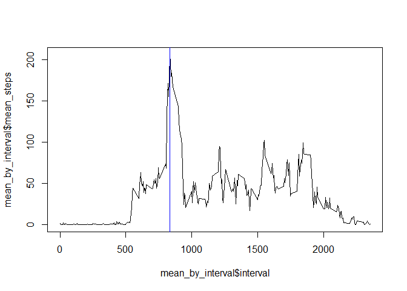
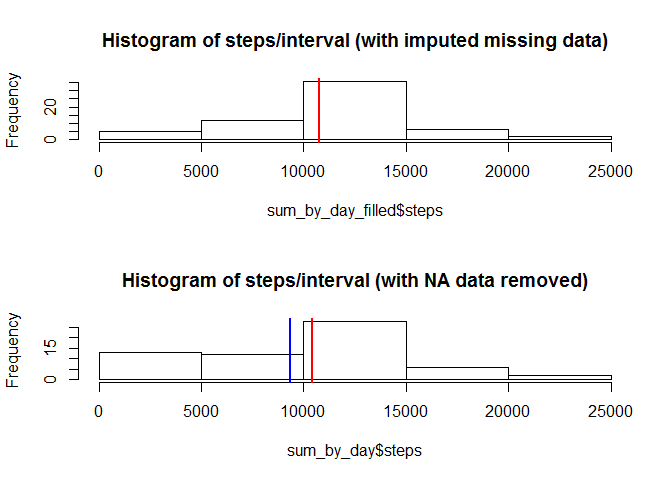
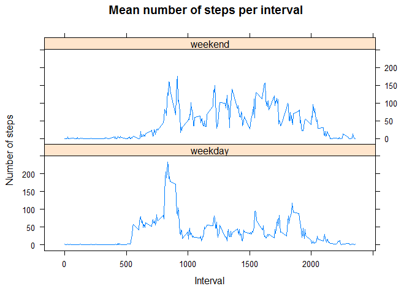

# Reproducible Research: Peer Assessment 1


## Loading and preprocessing the data

```r
#Ensure I am working in the right project directory. Uncomment only on my own system. Evaluators may need to set this themselves.
#setwd("C:\\Users\\cchubb\\Coursera\\DataScience\\5ReproducibleResearch\\RepData_PeerAssessment1")

#Clear out any local variables, start fresh and remove unneeded data from the global environment
rm(list = ls())

#Unizp the file if it hasn't already been unzipped
if (! file.exists("activity.csv")) {
  unzip("./activity.zip", overwrite=TRUE)
}

activity <- read.csv("activity.csv", stringsAsFactors = FALSE)

#Combine date and interval into a single POSICct date. 
#activity$date_time <- strptime(paste(activity$date, sprintf("%04d", activity$interval)), format="%Y-%m-%d %H%M")

#Load libraries
library(dplyr, quietly=TRUE)
```


## What is mean total number of steps taken per day?

```r
sum_by_day <- activity %>% 
  group_by(date) %>% 
  summarize(steps=sum(steps, na.rm=TRUE))

mean_steps <- mean(sum_by_day$steps)
median_steps <- median(sum_by_day$steps)

hist(sum_by_day$steps)
abline(v = mean_steps, col = "blue", lwd = 2)
abline(v = median_steps, col = "red", lwd = 2)
```

<!-- -->

There is a mean of 9354.2295082 and a median of 10395 steps per day.


## What is the average daily activity pattern?

```r
mean_by_interval <- activity %>% 
  group_by(interval) %>% 
  summarize(mean_steps=mean(steps, na.rm=T))

max_steps = max(mean_by_interval$mean_steps)
max_interval = as.numeric(mean_by_interval[mean_by_interval$mean_steps == max_steps, "interval"])

plot(mean_by_interval$interval, mean_by_interval$mean_steps, type="l", lwd=1)
abline(v = max_interval, col = "blue", lwd = 1)
```

<!-- -->

At 835 the maximum average of 206.1698113 was recorded. 

## Imputing missing values

```r
#Calculate and report the total number of missing values in the dataset (i.e. the total number of rows with NAs)
na_count <- sum(is.na(activity$steps))
```

There are 2304 missing values in the data set. 


```r
#Use the mean steps during an interval to fill in missing values 
activity_filled <- activity %>% 
  inner_join(mean_by_interval, by="interval") %>% 
  transform(steps = ifelse(is.na(steps), mean_steps, steps))
activity_filled$mean_steps <- NULL #Remove unneeded column

#Calculate the stats on the imputed data set
sum_by_day_filled <- activity_filled %>% 
  group_by(date) %>% 
  summarize(steps=sum(steps, na.rm=TRUE))

mean_steps_filled <- mean(sum_by_day_filled$steps)
median_steps_filled <- median(sum_by_day_filled$steps)

#Plot the change in the data set.
par(mfcol=c(2,1))
hist(sum_by_day_filled$steps, main="Histogram of steps/interval (with imputed missing data)")
abline(v = mean_steps_filled, col = "blue", lwd = 2)
abline(v = median_steps_filled, col = "red", lwd = 2)

hist(sum_by_day$steps, main="Histogram of steps/interval (with NA data removed)")
abline(v = mean_steps, col = "blue", lwd = 2)
abline(v = median_steps, col = "red", lwd = 2)
```

<!-- -->

After imputing, there is a mean of 1.0766189\times 10^{4} and a median of 1.0766189\times 10^{4} steps per day.

Before imputing there was a mean of 9354.2295082 and a median of 10395 steps per day.

## Are there differences in activity patterns between weekdays and weekends?

```r
#Create a new factor variable in the dataset with two levels - "weekday" and "weekend" indicating whether a given date is a weekday or weekend day.
activity$weekend <- ifelse(strptime(activity$date, format="%Y-%m-%d")$wday %in% c(0,6), "weekend", "weekday")

#Make a panel plot containing a time series plot (i.e. type = "l") of the 5-minute interval (x-axis) and the average number of steps taken, averaged across all weekday days or weekend days (y-axis). See the README file in the GitHub repository to see an example of what this plot should look like using simulated data.

avg_steps_weekend_interval <- activity %>% 
  group_by(weekend, interval) %>%
  summarize(steps = mean(steps, na.rm=T))

#Plot it
library(lattice)
xyplot(steps ~ interval | weekend, data=avg_steps_weekend_interval, type="l", xlab="Interval", ylab="Number of steps", main="Mean number of steps per interval", layout=c(1,2))
```

<!-- -->


